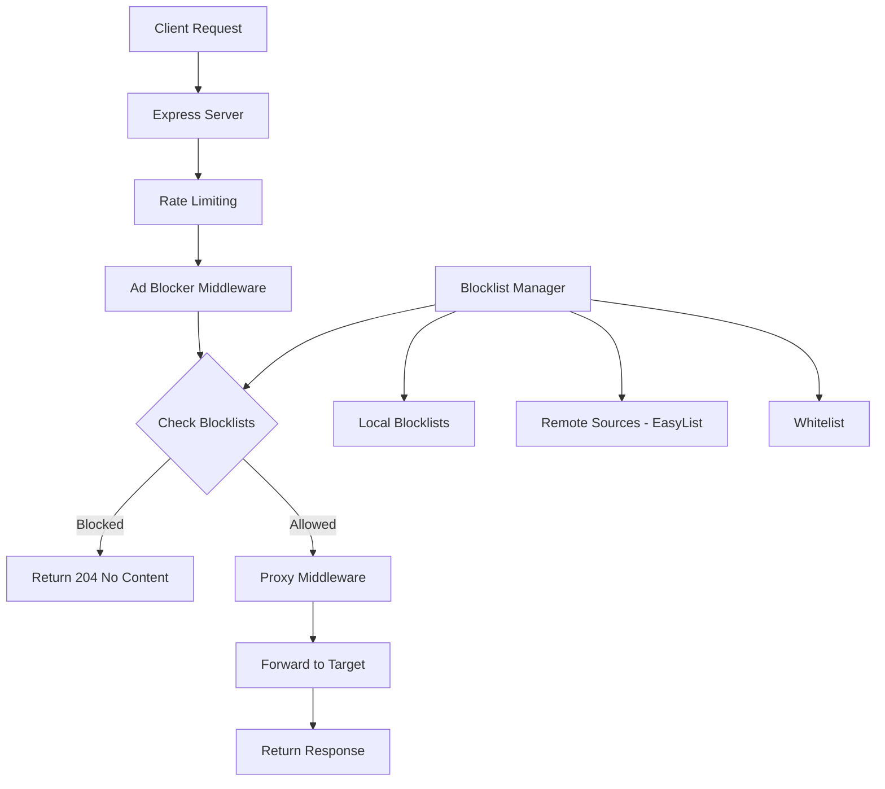

# Ads Blocker

A Node.js Express server that acts as an intelligent proxy to block advertisements, trackers, and malicious content. This lightweight solution provides enterprise-grade ad blocking capabilities with comprehensive APIs for management and monitoring.

## 🚀 Features

- **Intelligent Ad Blocking**: Blocks ads using domain blacklists and pattern matching
- **Real-time Proxy**: Acts as a transparent proxy for web requests
- **Multiple Blocklist Sources**: Integrates with EasyList and custom blocklists
- **Whitelist Support**: Allow specific domains to bypass blocking
- **Statistics & Analytics**: Track blocked vs allowed requests with detailed metrics
- **RESTful API**: Complete API for blocklist management and monitoring
- **Production Ready**: Includes logging, rate limiting, and error handling
- **Performance Optimized**: In-memory caching for fast blocklist lookups

## 🏗️ How It Works



### Architecture Overview

1. **Request Flow**:
   - Client sends request with target URL
   - Server applies rate limiting and security checks
   - Ad blocker middleware checks URL against blocklists
   - If blocked: returns 204 No Content
   - If allowed: proxies request to target and returns response

2. **Blocklist Management**:
   - Loads local blocklists on startup
   - Periodically updates from remote sources (EasyList)
   - Maintains in-memory cache for performance
   - Supports custom domain and pattern rules

3. **Statistics Tracking**:
   - Real-time counters for blocked/allowed requests
   - Daily statistics with historical data
   - Top blocked domains tracking
   - Performance metrics and uptime

## 📦 Installation

### Prerequisites
- Node.js 16+
- npm or yarn

### Quick Start

```bash
# Clone the repository
git clone https://github.com/drealdumore/ads-blocker.git

cd ads-blocker

# Install dependencies
npm install

# Copy environment configuration
cp .env.example .env

# Start the server
npm start

# For development with auto-reload
npm run dev
```

## 🔧 Configuration

### Environment Variables

Create a `.env` file based on `.env.example`:

```env
PORT=3000
NODE_ENV=production
ALLOWED_ORIGINS=*
LOG_LEVEL=info
RATE_LIMIT_WINDOW_MS=900000
RATE_LIMIT_MAX_REQUESTS=1000
BLOCKLIST_UPDATE_INTERVAL=24
PROXY_TIMEOUT=30000
```

### Custom Blocklists

Place custom blocklists in `src/data/blocklists/`:

- `domains.txt` - Domain-based blocking rules
- `patterns.txt` - Regex patterns for URL matching
- `whitelist.txt` - Domains to never block

## 🚀 Usage

### Basic Proxy Usage

Send requests through the proxy by providing the target URL:

```bash
# Using query parameter
curl "http://localhost:3000/?url=https://example.com"

# Using header
curl -H "X-Target-URL: https://example.com" http://localhost:3000/
```

### API Endpoints

#### Blocklist Management

```bash
# Check blocklist status
GET /api/blocklist/status

# Check if URL would be blocked
POST /api/blocklist/check
{
  "url": "https://example.com",
  "userAgent": "Mozilla/5.0...",
  "referer": "https://source.com"
}

# Add domain to blocklist
POST /api/blocklist/domain
{
  "domain": "ads.example.com"
}

# Remove domain from blocklist
DELETE /api/blocklist/domain
{
  "domain": "ads.example.com"
}

# Add domain to whitelist
POST /api/blocklist/whitelist
{
  "domain": "trusted.com"
}

# Update remote blocklists
POST /api/blocklist/update
```

#### Statistics & Analytics

```bash
# Get overall statistics
GET /api/stats

# Get daily statistics (last 7 days)
GET /api/stats/daily?days=7

# Get top blocked domains
GET /api/stats/top-blocked?limit=10

# Get recent blocked requests
GET /api/stats/recent?limit=50

# Reset statistics
POST /api/stats/reset
```

#### Health Check

```bash
# Server health status
GET /health
```

## 📊 API Response Examples

### Statistics Response
```json
{
  "success": true,
  "data": {
    "blocked": 1250,
    "allowed": 8750,
    "totalRequests": 10000,
    "blockRate": "12.50%",
    "uptime": 86400000,
    "requestsPerMinute": 6.94,
    "topBlockedDomains": [
      { "domain": "doubleclick.net", "count": 342 },
      { "domain": "googlesyndication.com", "count": 201 }
    ]
  }
}
```

### Blocklist Check Response
```json
{
  "success": true,
  "data": {
    "url": "https://ads.example.com/banner.js",
    "blocked": true,
    "reason": "Matches blocklist criteria"
  }
}
```

## 🛡️ Security Features

- **Rate Limiting**: Configurable request limits per IP
- **CORS Protection**: Configurable origin restrictions
- **Header Security**: Helmet.js for security headers
- **Input Validation**: URL validation and sanitization
- **Error Handling**: Graceful error responses
- **Logging**: Comprehensive request and error logging

## 🔍 Monitoring & Logging

### Log Files
- `logs/combined.log` - All application logs
- `logs/error.log` - Error-level logs only

### Log Levels
- `error` - Critical errors
- `warn` - Warning messages
- `info` - General information
- `debug` - Detailed debugging (development)

### Metrics Tracked
- Request counts (blocked/allowed)
- Response times
- Top blocked domains
- Daily/hourly statistics
- Error rates
- Uptime statistics
```

## 🧪 Testing

```bash
# Run tests
npm test

# Run linting
npm run lint

# Fix linting issues
npm run lint:fix
```

## 📈 Performance

- **Memory Usage**: ~50MB baseline + blocklist size
- **Response Time**: <10ms for blocklist checks
- **Throughput**: 1000+ requests/second
- **Blocklist Size**: 50,000+ domains from EasyList

## 🤝 Contributing

1. Fork the repository
2. Create a feature branch
3. Make your changes
4. Add tests if applicable
5. Run linting and tests
6. Submit a pull request


## 🆘 Support

- Documentation: Check this README
- Issues: GitHub Issues
- Performance: Check `/health` and `/api/stats` endpoints
